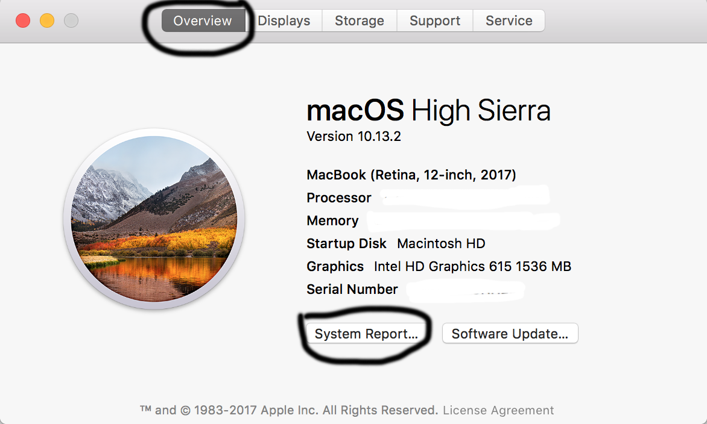
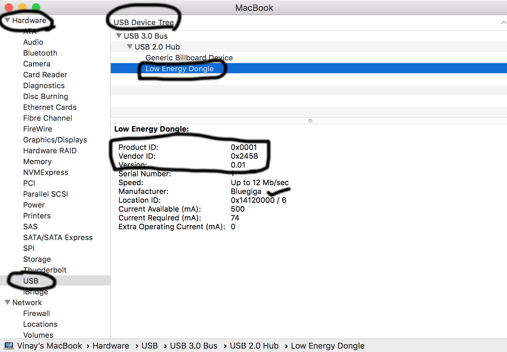

# Configuring BLED112 dongle
* I bought the BLED112 dongle [Bluegiga USB Dongle] (https://www.amazon.com/gp/product/B00HKILG1W)
* Plug it into the Mac book (my mac book: MacOS High Sierra, version 10.13.2)
* Make sure the device is detected
  * Go to `Apple Icon` -> `About this Mac`
  * Click on `System Report` button in the `Overview` tab 

    
  * In the left pane go to `Hardware` -> `USB`

    
  * On the right pane `USB Device Tree`, click on `Low Energy Dongle` (see above pic)
  * Make sure that of the following (else it wont work with current version of pyb00st)
    * `Product ID:	0x0001`
    * `Vendor ID:	0x2458`

* Test the `pygatt` adapter
```bash
Vinays-MacBook:voost vinkolar$ python3 setuputils/testadapter.py
INFO:pygatt.backends.bgapi.bgapi:Initialized new BGAPI backend
DEBUG:pygatt.backends.bgapi.bgapi:Opening connection to serial port (attempt 1)
INFO:pygatt.backends.bgapi.bgapi:Auto-detecting serial port for BLED112
DEBUG:pygatt.backends.bgapi.util:Found 3 serial USB devices
DEBUG:pygatt.backends.bgapi.util:Checking serial USB device: /dev/cu.SSDC - n/a
DEBUG:pygatt.backends.bgapi.util:Checking serial USB device: /dev/cu.Bluetooth-Incoming-Port - n/a
DEBUG:pygatt.backends.bgapi.util:Checking serial USB device: /dev/cu.usbmodem1 - Low Energy Dongle
DEBUG:pygatt.backends.bgapi.util:USB device: Low Energy Dongle VID=0x2458 PID=0x0001 on /dev/cu.usbmodem1
INFO:pygatt.backends.bgapi.bgapi:Found BLED112 on serial port /dev/cu.usbmodem1
INFO:pygatt.backends.bgapi.bgapi:Resetting and reconnecting to device for a clean environment
DEBUG:pygatt.backends.bgapi.bgapi:Opening connection to serial port (attempt 1)
INFO:pygatt.backends.bgapi.bgapi:Auto-detecting serial port for BLED112
DEBUG:pygatt.backends.bgapi.util:Found 3 serial USB devices
DEBUG:pygatt.backends.bgapi.util:Checking serial USB device: /dev/cu.SSDC - n/a
DEBUG:pygatt.backends.bgapi.util:Checking serial USB device: /dev/cu.Bluetooth-Incoming-Port - n/a
DEBUG:pygatt.backends.bgapi.util:Checking serial USB device: /dev/cu.usbmodem1 - Low Energy Dongle
DEBUG:pygatt.backends.bgapi.util:USB device: Low Energy Dongle VID=0x2458 PID=0x0001 on /dev/cu.usbmodem1
INFO:pygatt.backends.bgapi.bgapi:Found BLED112 on serial port /dev/cu.usbmodem1
DEBUG:pygatt.backends.bgapi.bgapi:Failed to open serial port
Traceback (most recent call last):
  File "/usr/local/lib/python3.6/site-packages/serial/serialposix.py", line 265, in open
    self.fd = os.open(self.portstr, os.O_RDWR | os.O_NOCTTY | os.O_NONBLOCK)
OSError: [Errno 6] Device not configured: '/dev/cu.usbmodem1'

During handling of the above exception, another exception occurred:

Traceback (most recent call last):
  File "/usr/local/lib/python3.6/site-packages/pygatt/backends/bgapi/bgapi.py", line 159, in _open_serial_port
    timeout=0.25)
  File "/usr/local/lib/python3.6/site-packages/serial/serialutil.py", line 240, in __init__
    self.open()
  File "/usr/local/lib/python3.6/site-packages/serial/serialposix.py", line 268, in open
    raise SerialException(msg.errno, "could not open port {}: {}".format(self._port, msg))
serial.serialutil.SerialException: [Errno 6] could not open port /dev/cu.usbmodem1: [Errno 6] Device not configured: '/dev/cu.usbmodem1'
Traceback (most recent call last):
  File "/usr/local/lib/python3.6/site-packages/serial/serialposix.py", line 265, in open
    self.fd = os.open(self.portstr, os.O_RDWR | os.O_NOCTTY | os.O_NONBLOCK)
OSError: [Errno 6] Device not configured: '/dev/cu.usbmodem1'

During handling of the above exception, another exception occurred:

Traceback (most recent call last):
  File "/usr/local/lib/python3.6/site-packages/pygatt/backends/bgapi/bgapi.py", line 159, in _open_serial_port
    timeout=0.25)
  File "/usr/local/lib/python3.6/site-packages/serial/serialutil.py", line 240, in __init__
    self.open()
  File "/usr/local/lib/python3.6/site-packages/serial/serialposix.py", line 268, in open
    raise SerialException(msg.errno, "could not open port {}: {}".format(self._port, msg))
serial.serialutil.SerialException: [Errno 6] could not open port /dev/cu.usbmodem1: [Errno 6] Device not configured: '/dev/cu.usbmodem1'

During handling of the above exception, another exception occurred:

Traceback (most recent call last):
  File "setuputils/testadapter.py", line 13, in <module>
    adapter.start()
  File "/usr/local/lib/python3.6/site-packages/pygatt/backends/bgapi/bgapi.py", line 202, in start
    self._open_serial_port()
  File "/usr/local/lib/python3.6/site-packages/pygatt/backends/bgapi/bgapi.py", line 170, in _open_serial_port
    "No BGAPI compatible device detected")
pygatt.exceptions.NotConnectedError: No BGAPI compatible device detected
```